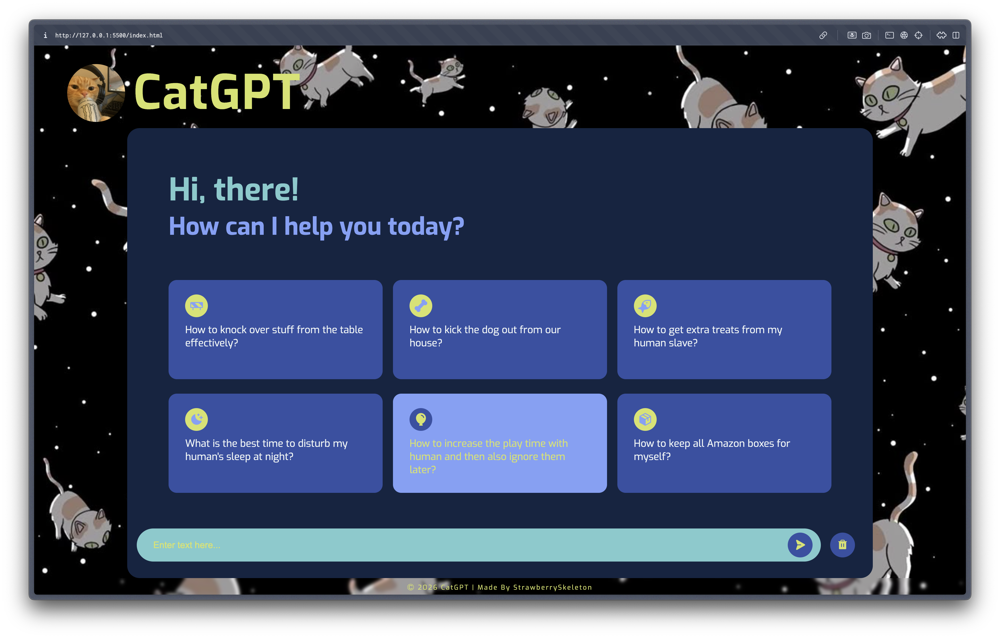
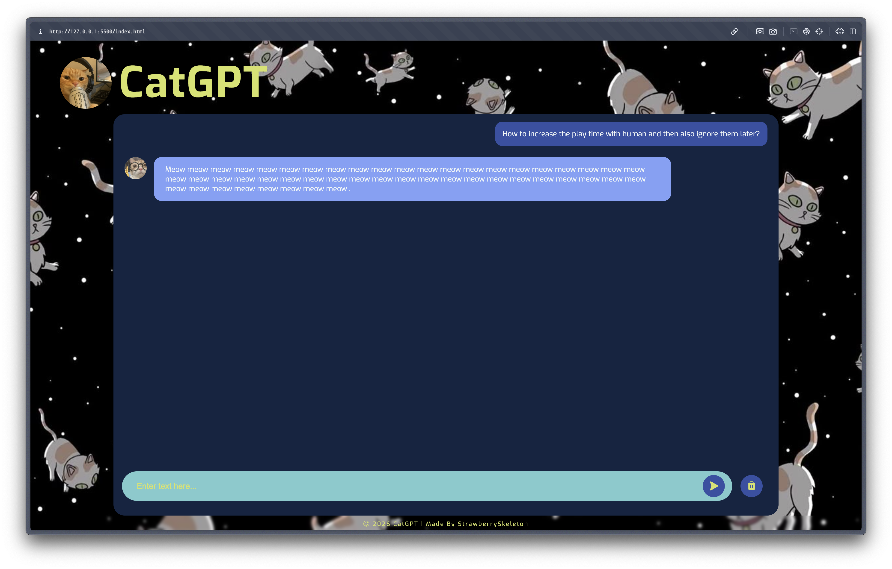
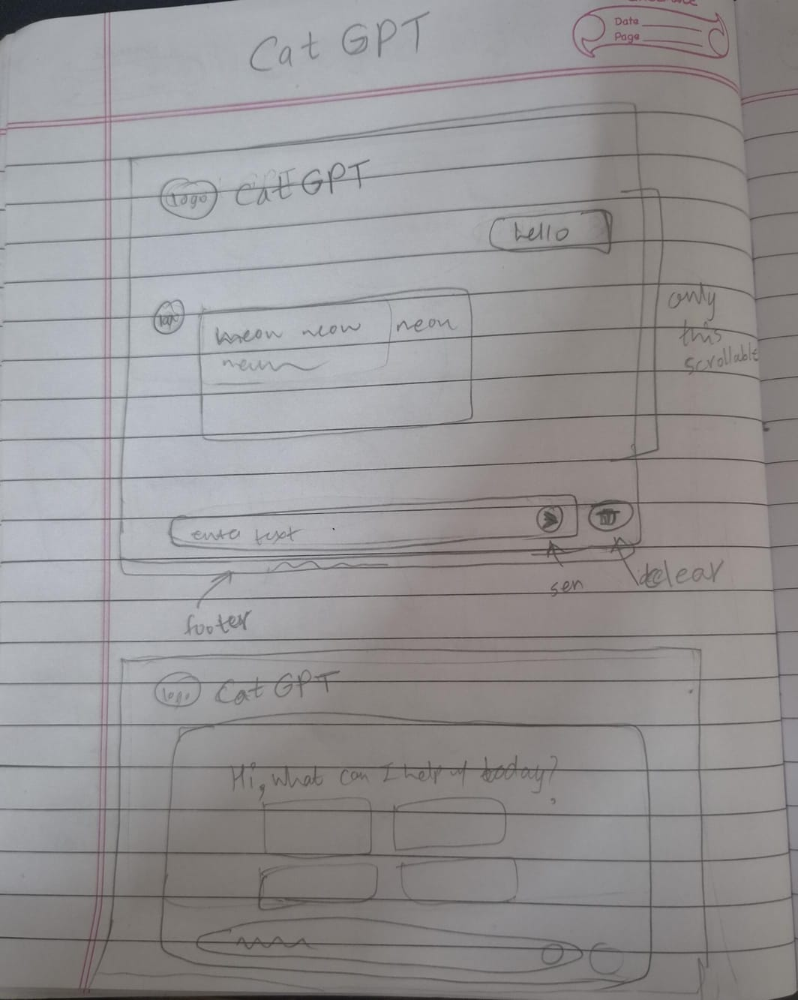

# CatGPT
meow meow

ai platforrm but the ai is a cat so it only meows back

## Features
- ai llm like layout (took inspo from a lot of YT videos and genAI platofrms like chatgpts, gemini, etc.)
- an aesthetic ui theme (shoutout to pintrest for colors, images and bg)
- random number of meows back on every query
- query suggestions page (like present in most ai platfroms)

## Project Screenshots

## Making Process

1. i made a rough layout plan in my notebook

2. found some logo assets wehn i searched for CatGPT on google and decided that i will use that logo and theme
3. made the main layout structure in html and css
4. added core functionality of adding query+reply in chat area and generating a random no. of meows reply in JS
5. decided to add a suggestion queries page when we open the chatbot too, so implmented that
6. strarted owrking on the design + made some bug fixes
7. spend painfully long to make a "modern aesthetic" background. referenced codepen for main layout, and asked for gemini's help for trying to make it dark mode. tested the code in a lot fo ways, tried with differetn svg/data uri bgs but then settles on the original with inverted colors
8. found a color theme on pinterest and added it to the project
9. while doomscrolling, came across a cool space cat backgrond on pinterest. i wanted to keep that (mostly becuase the "ultra modern dark aesthetic" bg was barely visible; minorly because the theme looked like whatsapp in dark mode...), but the existing color theme didn't match the new bg
10. found a new color theme on pinterest and added that. also found and added a font.
11. debugged the icons not rendering (took a lot of time), turns out it was just css being css. [issue at hand was that i added font in the * selector, should've just sticked to body selector...] (tried different icon libraries like remixicons, etc. because i thought maybe phosphoricons was down...)
12. added some polish (css hover effects, layout adjustments, small bug fixing, etc.) 

## Credits
- made by me
- background remover: [Photoroom BG Remover](https://www.photoroom.com/tools/background-remover)
- icon set: [Phosphor Icons](https://phosphoricons.com/)
- favicon: [pinterest pin](https://in.pinterest.com/pin/34058540927789208/)
- profile logo in reply message: [pinterest pin](https://in.pinterest.com/pin/24347654231917780/)
- main logo: [pinterest pin](https://in.pinterest.com/pin/1117455726319390950/)
- backgroud img: [pinterest pin](https://in.pinterest.com/pin/1196337403023665/)
- color theme: [pinterest pin](https://in.pinterest.com/pin/751256781636320359/)
- font: [google fonts - Exo](https://fonts.google.com/specimen/Exo?preview.script=Latn)

> Shoutout to stuff that i worked on for a lot of time but then didn't put it later due to design changes
> - svg background generator: https://www.fffuel.co/ooorganize/
> - svg to data uri encoder: https://yoksel.github.io/url-encoder/
> - aesthetic modern kinda premium-y bg: https://codepen.io/kootoopas/pen/kGPoaB
> - color theme: https://in.pinterest.com/pin/211174977142847/